plant-import-paper-r-markdown
================
pgfarsund
2023

this markdown document contains code for the analysis and results
already implemented in the manuscript for “the plant import paper” (in
prep for Biological Invasions). in addition the these results, another
script (“additional-analyses-for-the-plant-import-paper”) contains
analyses of the same data that have not (yet) been implemented in the
manuscript.

``` r
library(phyloseq)
library(tidyverse)
```

    ## ── Attaching core tidyverse packages ──────────────────────── tidyverse 2.0.0 ──
    ## ✔ dplyr     1.1.0     ✔ readr     2.1.4
    ## ✔ forcats   1.0.0     ✔ stringr   1.5.0
    ## ✔ ggplot2   3.4.3     ✔ tibble    3.2.0
    ## ✔ lubridate 1.9.3     ✔ tidyr     1.3.0
    ## ✔ purrr     1.0.2     
    ## ── Conflicts ────────────────────────────────────────── tidyverse_conflicts() ──
    ## ✖ dplyr::filter() masks stats::filter()
    ## ✖ dplyr::lag()    masks stats::lag()
    ## ℹ Use the conflicted package (<http://conflicted.r-lib.org/>) to force all conflicts to become errors

``` r
library(ggpubr)
```

load and manipulate phyloseq objects:

``` r
### plants

# load data:
plants = readRDS(file = "plants-phyloseq-object.RDS") # change the path to data's location on your computer.

# manipulate the sample data:
sam = data.frame(plants@sam_data) %>% 
  dplyr::select("sample","Location_name",            # there is a lot of data we don't need.
                "Specific_host",
                "Sample_ID") %>% 
  rename(c("container"="Location_name",              # rename columns for simplicity.
           "host"="Specific_host", 
           "sample_id"="Sample_ID")) %>% 
  mutate(sample=sub("PLANTEIMP_21_", "", sample),    # easier to interpret sample number.
         sample=sub("_ITS_S2_ITS4", "", sample)) %>% 
  mutate(container = sub("Bil ", "", container)) %>% # remove "Bil " from the container ID.
  mutate(pot_id = c(rep(paste0("p", 1:5), each=2),   # add an ID to each pot - this will be
                    rep(paste0("p", 6:15), each=1),  # identical between samples taken from
                    rep(paste0("p", 16:20), each=2), # the same pot.
                    rep(paste0("p", 21:30), each=1),
                    rep(paste0("p", 31:35), each=2),
                    rep(paste0("p", 36:45), each=1),
                    rep(paste0("p", 46:50), each=2),
                    rep(paste0("p", 51:60), each=1))) %>%
  mutate(interval = c(rep("double", times=10),
                      rep("single", times=10),
                      rep("double", times=10),
                      rep("single", times=10),
                      rep("double", times=10),
                      rep("single", times=10), 
                      rep("double", times=10),
                      rep("single", times=10))); str(sam) 
```

    ## 'data.frame':    80 obs. of  6 variables:
    ##  $ sample   : chr  "001" "002" "003" "004" ...
    ##  $ container: chr  "2" "2" "2" "2" ...
    ##  $ host     : chr  "Taxus" "Taxus" "Taxus" "Taxus" ...
    ##  $ sample_id: chr  "1_1" "1_2" "2_1" "2_2" ...
    ##  $ pot_id   : chr  "p1" "p1" "p2" "p2" ...
    ##  $ interval : chr  "double" "double" "double" "double" ...

``` r
sample_data(plants) = sample_data(sam); rm(sam); plants
```

    ## phyloseq-class experiment-level object
    ## otu_table()   OTU Table:         [ 104 taxa and 80 samples ]
    ## sample_data() Sample Data:       [ 80 samples by 6 sample variables ]
    ## tax_table()   Taxonomy Table:    [ 104 taxa by 6 taxonomic ranks ]
    ## refseq()      DNAStringSet:      [ 104 reference sequences ]

``` r
# for this study we're only interested in vascular plants. our data set contains
# some bryophytes and green algae, additionally we're not interested in Taxus sp. 
# or Thuja sp., because these were ornamentals in the sampled soil. 
# remove non-focal taxa:
plants=subset_taxa(plants, phylum=="Streptophyta")
plants=subset_taxa(plants, class!="Chlorophyceae")
plants=subset_taxa(plants, order!="Splachnales")
plants=subset_taxa(plants, order!="Bryales")
plants=subset_taxa(plants, order!="Dicranales")
plants=subset_taxa(plants, order!="Funariales")
plants=subset_taxa(plants, order!="Hypnales")
plants=subset_taxa(plants, order!="Klebsormidiaceae")
plants=subset_taxa(plants, order!="Pottiales")
plants=subset_taxa(plants, order!="Pseudoditrichales")
plants=subset_taxa(plants, species!="Thuja_sp.")
plants=subset_taxa(plants, species!="Thuja_occidentalis")
plants=subset_taxa(plants, species!="Taxus_sp.")
plants=subset_taxa(plants, species!="Taxus_canadensis"); plants
```

    ## phyloseq-class experiment-level object
    ## otu_table()   OTU Table:         [ 85 taxa and 80 samples ]
    ## sample_data() Sample Data:       [ 80 samples by 6 sample variables ]
    ## tax_table()   Taxonomy Table:    [ 85 taxa by 6 taxonomic ranks ]
    ## refseq()      DNAStringSet:      [ 85 reference sequences ]

``` r
### fungi

# load data:
fungi = readRDS(file = "fungi-phyloseq-object.RDS") # change the path to data's location on your computer
fungi = subset_samples(fungi, negative_control=="FALSE")

# manipulate the sample data:
sam = data.frame(fungi@sam_data) %>% 
  dplyr::select("sample","Location_name",            # there is a lot of data we don't need
                "Specific_host",
                "Sample_ID") %>%
  rename(c("container"="Location_name",              # rename columns for simplicity
           "host"="Specific_host", 
           "sample_id"="Sample_ID")) %>% 
  mutate(sample=sub("PLANTEIMP_21_", "", sample),    # easier to interpret sample number
         sample=sub("_fITS7_ITS4", "", sample)) %>% 
  mutate(container = sub("Bil ", "", container)) %>% # remove "Bil " from the container ID
  mutate(pot_id = c(rep(paste0("p", 1:5), each=2),   # add an ID to each pot - this will be
                    rep(paste0("p", 6:15), each=1),  # identical between samples taken from
                    rep(paste0("p", 16:20), each=2), # the same pot
                    rep(paste0("p", 21:30), each=1),
                    rep(paste0("p", 31:35), each=2),
                    rep(paste0("p", 36:45), each=1),
                    rep(paste0("p", 46:50), each=2),
                    rep(paste0("p", 51:60), each=1))) %>%
  mutate(interval = c(rep("double", times=10),
                      rep("single", times=10),
                      rep("double", times=10),
                      rep("single", times=10),
                      rep("double", times=10),
                      rep("single", times=10), 
                      rep("double", times=10),
                      rep("single", times=10)))
sample_data(fungi) = sample_data(sam); rm(sam); fungi
```

    ## phyloseq-class experiment-level object
    ## otu_table()   OTU Table:         [ 4618 taxa and 80 samples ]
    ## sample_data() Sample Data:       [ 80 samples by 6 sample variables ]
    ## tax_table()   Taxonomy Table:    [ 4618 taxa by 7 taxonomic ranks ]
    ## refseq()      DNAStringSet:      [ 4618 reference sequences ]

##### RESULTS

### contaminant plants and fungi \### (Fig. 1)

we identified many contaminant plants and fungi that were native, known
aliens, and potential alien species to Norway. we’ve grouped these
species as “Native”, “Alien”, “Swe., Fin., Den.” (i.e. native to
Norway’s neighboring countries), (native to) “Europe”, and (native to)
“Non-Europe”. we will make a stacked bar chart to show the relative
frequencies of these different categories:

``` r
# build the data frame:
df = data.frame("freq" = c(30.30, 45.45, 0, 12.12, 12.12, 0, # start with plant frequencies
                           39.53, 0.81, 22.32, 22.89, 10.88, 3.57), # then fungal frequencies
                "group" = rep(c("Plants",
                                "Fungi"), each=6),
                "cats" = c(rep(c("Native",
                                 "Alien",
                                 "Swe., Fin., Den.",
                                 "Europe", 
                                 "Non-Europe",
                                 "NA"), times=2)))

# make Figure 1 in the manuscript:
fig.1 = df %>%
ggplot(aes(x=factor(group, 
                    level=c("Plants",
                            "Fungi")), # order the groups on the x-axis
           y=freq, 
           fill=factor(cats, 
                       levels = c("Native", # we want the stacked bars to have this specific order
                                  "Alien", 
                                  "Swe., Fin., Den.",
                                  "Europe", 
                                  "Non-Europe", 
                                  "NA")),
           color=factor(cats, 
                        levels = c("Native", 
                                   "Alien", 
                                   "Swe., Fin., Den.",
                                   "Europe", 
                                   "Non-Europe", 
                                   "NA")))) + 
  geom_col(position = "fill", 
           width = 0.55) + 
  theme_classic(base_size = 15) +
  scale_fill_manual(values = c("#E69F00", "#56B4E9", "#009E73", # some nice colors to fill the bars
                               "#F0E442", "#CC79A7", "#999999")) +
  scale_color_manual(values = rep("black", times = 6)) +
  theme(legend.position = "right") +
  theme(axis.title.x = element_blank(),
        axis.title.y = element_blank(),
        legend.title = element_blank()) +
  annotate(geom = "text", 
           label = c("30.3 %", 
                     "45.5 %",
                     "12.1 %",
                     "12.1 %", 
                     "39.5 %",
                     "0.8 %",
                     "22.3 %", 
                     "22.9 %", 
                     "10.9 %",
                     "3.6 %"),
           x = rep(c(1,
                     2,
                     2.45,
                     2,
                     2.45), # we want "0.8 %" and "3.6 %" outside the actual bar, which makes this a bit tricky
                   times = c(4,
                             1,
                             1,
                             3,
                             1)), 
           y = c(0.84, 0.45, 0.18, 0.06, # plant percent labels
                 0.8, 0.6, 0.5, 0.26, 0.1, 0.02), # fungi percent labels
           size = 4, color = "black", fontface = 1) + 
  annotate(geom = "segment", 
           x = rep(2.25,
                   times=2), 
           xend = rep(2.315, 
                      times=2), 
           y = c(0.60,
                 0.02), 
           yend = c(0.60,
                    0.02)) + 
  scale_y_continuous(labels = scales::percent); fig.1 # save as .pdf landscape 5 x 6
```

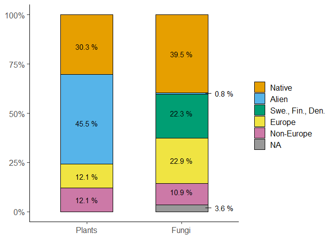<!-- -->

### metabarcoding vs. germination \### (Fig. 2)

we identified 33 plant species with metabarcoding and 30 with
germination. five species were identified by both methods, adding up to
58 contaminant plant species identified all together. we also checked
whether identified plants were registered as products in the online
assortments of Noviflora and Plantasjen in the fall of 2021 (the year of
sampling). we will make two stacked bar charts to show how many species
fall into each category, while also showing how many species were
identified with metabarcoding, germination, or both:

``` r
df2 = read.csv(file = "C:/Users/pgfar/Dropbox/Whats_in_the_pot/plant-import-paper/fig_2_dataset.csv",
               sep = ";"); str(df2) # change path 
```

    ## 'data.frame':    58 obs. of  4 variables:
    ##  $ species   : chr  "Acer pseudoplatanus" "Aegopodium podagraria" "Allium sativum" "Arabidopsis thaliana" ...
    ##  $ id_method : chr  "Metabarcoding" "Metabarcoding" "Metabarcoding" "Germination" ...
    ##  $ ornamental: logi  TRUE FALSE TRUE FALSE TRUE TRUE ...
    ##  $ prev_det  : logi  FALSE FALSE FALSE TRUE TRUE FALSE ...

``` r
my_colors = c("#CC79A7",
              "#009E73",
              "#E69F00")

a = df2 %>% 
  mutate(prev_det=sub("TRUE", "Yes", prev_det)) %>% 
  mutate(prev_det=sub("FALSE", "No", prev_det)) %>% 
  ggplot(aes(x=factor(prev_det, 
                             levels = c("Yes", 
                                        "No")),
                color=factor(id_method,
                             levels = c("Metabarcoding",
                                        "Germination",
                                        "Both")),
                fill=factor(id_method,
                            levels = c("Metabarcoding",
                                       "Germination",
                                       "Both")))) + 
  geom_bar(position = "stack",
           width = 0.55) +
  scale_fill_manual(values = my_colors) +
  scale_color_manual(values = rep("black", times=3)) +
  theme_classic(base_size = 15) + 
  xlab("Previously identified?") + 
  ylab("Number of plant species") + 
  labs(fill = "Identification\nmethod", 
       color = "Identification\nmethod", 
       subtitle = "a.") +
  theme(legend.title = element_text(size = 13)) +
  scale_y_continuous(breaks = seq(0, 45, 10), 
                     limits = c(0, 45)); a
```

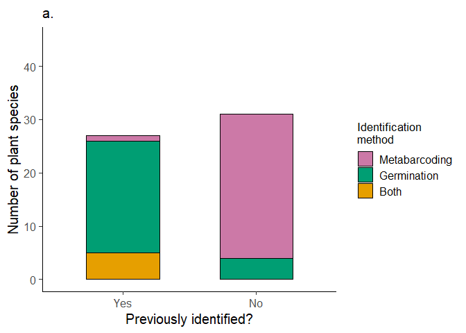<!-- -->

``` r
b = df2 %>% 
  mutate(ornamental=sub("TRUE", "Yes", ornamental)) %>% 
  mutate(ornamental=sub("FALSE", "No", ornamental)) %>% 
  ggplot(aes(x=factor(ornamental, 
                             levels = c("Yes", 
                                        "No")),
                color=factor(id_method,
                           levels = c("Metabarcoding",
                                      "Germination",
                                      "Both")),
                fill=factor(id_method,
                           levels = c("Metabarcoding",
                                      "Germination",
                                      "Both")))) + 
  geom_bar(position = "stack",
           width = 0.55) +
  scale_fill_manual(values = my_colors) +
  scale_color_manual(values = rep("black", times=3)) +
  theme_classic(base_size = 15) + 
  xlab("Ornamental?") + 
  ylab(" ") + 
  labs(fill = "Identification\nmethod", 
       color = "Identification\nmethod", 
       subtitle = "b.") +
  theme(legend.title = element_text(size = 13)) +
  scale_y_continuous(breaks = seq(0, 55, 10), 
                     limits = c(0, 45)); b
```

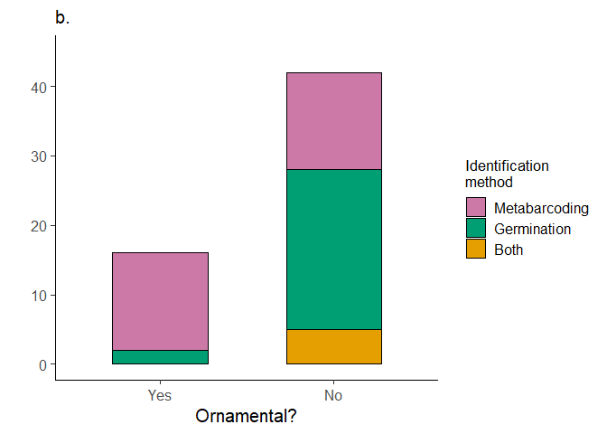<!-- -->

``` r
fig.2 = ggarrange(a, b, 
                    common.legend = TRUE,
                    legend = "right", 
                    nrow = 1); fig.2
```

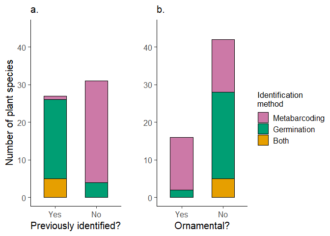<!-- -->

### effect of sampling strategy on contaminant species richness \### (Fig. 3)

we want to investigate the effect of sampling effort on the observed
species richness of contaminant plants and fungi identified by
metabarcoding. we’ll do this in two steps:

1.  we want to know whether a larger volume of soil per sample had an
    effect on the observed species richness per pot. unfortunately, all
    samples consited of approximately 25 grams. we’re therefore going to
    simulate doubling the soil sample volume by merging samples that
    were taken from the same same pot, prior to normalizing the read
    counts across all samples:

``` r
# we're going to merge samples from the same pots. to do this, we first create a 
# new phyloseq object with only the samples we're going to merge: 
twice = subset_samples(plants, interval == "double"); twice
```

    ## phyloseq-class experiment-level object
    ## otu_table()   OTU Table:         [ 85 taxa and 40 samples ]
    ## sample_data() Sample Data:       [ 40 samples by 6 sample variables ]
    ## tax_table()   Taxonomy Table:    [ 85 taxa by 6 taxonomic ranks ]
    ## refseq()      DNAStringSet:      [ 85 reference sequences ]

``` r
twice.m = merge_samples(twice, group = "pot_id"); twice.m 
```

    ## Warning in asMethod(object): NAs introduced by coercion

    ## Warning in asMethod(object): NAs introduced by coercion

    ## Warning in asMethod(object): NAs introduced by coercion

    ## Warning in asMethod(object): NAs introduced by coercion

    ## phyloseq-class experiment-level object
    ## otu_table()   OTU Table:         [ 85 taxa and 20 samples ]
    ## sample_data() Sample Data:       [ 20 samples by 6 sample variables ]
    ## tax_table()   Taxonomy Table:    [ 85 taxa by 6 taxonomic ranks ]

``` r
# reassign sample data in twice.m:
twice.m@sam_data$pot_id = rownames(twice.m@sam_data) # fix pot_id variable
twice.m@sam_data$pot_id = sub("p","",twice.m@sam_data$pot_id) 
twice.m@sam_data$pot_id = as.numeric(twice.m@sam_data$pot_id) # this will let us sort by pot_id
twice.m.sam = data.frame(twice.m@sam_data) %>%  # using arrange() in dplyr
  arrange(pot_id) %>%
  mutate(pot_id=paste0("p",pot_id))

# now make an identical dataframe to get variables from: 
sam = data.frame(twice@sam_data) 
sam = sam %>%
  filter(sample_id!="1_2") %>%
  filter(sample_id!="2_2") %>%
  filter(sample_id!="3_2") %>%
  filter(sample_id!="4_2") %>%
  filter(sample_id!="5_2")

# and reassign variables: 
twice.m.sam$host = sam$host
twice.m.sam$container = sam$container
twice.m.sam$interval = sam$interval

# convert til sample_data() object:
twice.m.sam = sample_data(twice.m.sam); sample_names(twice.m.sam)
```

    ##  [1] "p1"  "p2"  "p3"  "p4"  "p5"  "p16" "p17" "p18" "p19" "p20" "p31" "p32"
    ## [13] "p33" "p34" "p35" "p46" "p47" "p48" "p49" "p50"

``` r
# and reassign to twice.m phyloseq object: 
sample_data(twice.m) = twice.m.sam; twice.m; head(twice.m@sam_data)
```

    ## phyloseq-class experiment-level object
    ## otu_table()   OTU Table:         [ 85 taxa and 20 samples ]
    ## sample_data() Sample Data:       [ 20 samples by 6 sample variables ]
    ## tax_table()   Taxonomy Table:    [ 85 taxa by 6 taxonomic ranks ]

    ##     sample container  host sample_id pot_id interval
    ## p1     1.5         2 Taxus        NA     p1   double
    ## p16   21.5         2 Thuja        NA    p16   double
    ## p17   23.5         2 Thuja        NA    p17   double
    ## p18   25.5         2 Thuja        NA    p18   double
    ## p19   27.5         2 Thuja        NA    p19   double
    ## p2     3.5         2 Taxus        NA     p2   double

``` r
# now we want to get the merged samples back in the original dataset. we first
# create a new dataset with only samples from pots sampled once: 
once = subset_samples(plants, interval == "single"); once
```

    ## phyloseq-class experiment-level object
    ## otu_table()   OTU Table:         [ 85 taxa and 40 samples ]
    ## sample_data() Sample Data:       [ 40 samples by 6 sample variables ]
    ## tax_table()   Taxonomy Table:    [ 85 taxa by 6 taxonomic ranks ]
    ## refseq()      DNAStringSet:      [ 85 reference sequences ]

``` r
# and now we can merge the two phyloseq objects:
plants2 = merge_phyloseq(twice.m, once); plants2
```

    ## phyloseq-class experiment-level object
    ## otu_table()   OTU Table:         [ 85 taxa and 60 samples ]
    ## sample_data() Sample Data:       [ 60 samples by 6 sample variables ]
    ## tax_table()   Taxonomy Table:    [ 85 taxa by 6 taxonomic ranks ]
    ## refseq()      DNAStringSet:      [ 85 reference sequences ]

``` r
sort(sample_sums(plants2))
```

    ## PLANTEIMP_21_073_ITS_S2_ITS4 PLANTEIMP_21_035_ITS_S2_ITS4 
    ##                          721                         3376 
    ## PLANTEIMP_21_036_ITS_S2_ITS4 PLANTEIMP_21_078_ITS_S2_ITS4 
    ##                         4492                         7153 
    ## PLANTEIMP_21_076_ITS_S2_ITS4 PLANTEIMP_21_080_ITS_S2_ITS4 
    ##                        14215                        14215 
    ## PLANTEIMP_21_038_ITS_S2_ITS4 PLANTEIMP_21_051_ITS_S2_ITS4 
    ##                        17131                        17359 
    ##                          p16 PLANTEIMP_21_013_ITS_S2_ITS4 
    ##                        19007                        21915 
    ## PLANTEIMP_21_034_ITS_S2_ITS4 PLANTEIMP_21_075_ITS_S2_ITS4 
    ##                        30848                        37490 
    ## PLANTEIMP_21_032_ITS_S2_ITS4                          p20 
    ##                        37827                        41423 
    ## PLANTEIMP_21_074_ITS_S2_ITS4                          p46 
    ##                        45383                        47137 
    ## PLANTEIMP_21_059_ITS_S2_ITS4 PLANTEIMP_21_077_ITS_S2_ITS4 
    ##                        51899                        58720 
    ##                          p48 PLANTEIMP_21_072_ITS_S2_ITS4 
    ##                        72979                        86942 
    ##                          p19 PLANTEIMP_21_018_ITS_S2_ITS4 
    ##                        89241                        90536 
    ##                          p47 PLANTEIMP_21_039_ITS_S2_ITS4 
    ##                       108698                       136998 
    ##                          p32 PLANTEIMP_21_071_ITS_S2_ITS4 
    ##                       149728                       153484 
    ##                          p50                          p18 
    ##                       209234                       236869 
    ## PLANTEIMP_21_056_ITS_S2_ITS4 PLANTEIMP_21_033_ITS_S2_ITS4 
    ##                       239318                       300235 
    ## PLANTEIMP_21_012_ITS_S2_ITS4                          p17 
    ##                       315543                       318731 
    ## PLANTEIMP_21_014_ITS_S2_ITS4                          p49 
    ##                       329935                       336165 
    ## PLANTEIMP_21_040_ITS_S2_ITS4 PLANTEIMP_21_019_ITS_S2_ITS4 
    ##                       339215                       358085 
    ## PLANTEIMP_21_031_ITS_S2_ITS4 PLANTEIMP_21_020_ITS_S2_ITS4 
    ##                       364453                       392379 
    ## PLANTEIMP_21_057_ITS_S2_ITS4 PLANTEIMP_21_060_ITS_S2_ITS4 
    ##                       449439                       458539 
    ## PLANTEIMP_21_053_ITS_S2_ITS4                           p2 
    ##                       464603                       477231 
    ## PLANTEIMP_21_054_ITS_S2_ITS4 PLANTEIMP_21_016_ITS_S2_ITS4 
    ##                       486910                       512984 
    ## PLANTEIMP_21_011_ITS_S2_ITS4 PLANTEIMP_21_052_ITS_S2_ITS4 
    ##                       529531                       545171 
    ## PLANTEIMP_21_079_ITS_S2_ITS4 PLANTEIMP_21_055_ITS_S2_ITS4 
    ##                       580927                       582996 
    ##                           p1                          p35 
    ##                       646461                       679650 
    ## PLANTEIMP_21_015_ITS_S2_ITS4                          p34 
    ##                       682715                       697315 
    ##                          p31                           p5 
    ##                       752208                       761815 
    ## PLANTEIMP_21_017_ITS_S2_ITS4                           p3 
    ##                       831364                       937068 
    ##                          p33                           p4 
    ##                       993917                      1011932 
    ## PLANTEIMP_21_037_ITS_S2_ITS4 PLANTEIMP_21_058_ITS_S2_ITS4 
    ##                      1998023                      3278949

``` r
f2rar = rarefy_even_depth(plants2, 
                          rngseed = 123, 
                          replace = FALSE, 
                          trimOTUs = TRUE, 
                          sample.size = 14215); plants2; f2rar
```

    ## `set.seed(123)` was used to initialize repeatable random subsampling.

    ## Please record this for your records so others can reproduce.

    ## Try `set.seed(123); .Random.seed` for the full vector

    ## ...

    ## 4 samples removedbecause they contained fewer reads than `sample.size`.

    ## Up to first five removed samples are:

    ## PLANTEIMP_21_035_ITS_S2_ITS4PLANTEIMP_21_036_ITS_S2_ITS4PLANTEIMP_21_073_ITS_S2_ITS4PLANTEIMP_21_078_ITS_S2_ITS4

    ## ...

    ## 6OTUs were removed because they are no longer 
    ## present in any sample after random subsampling

    ## ...

    ## phyloseq-class experiment-level object
    ## otu_table()   OTU Table:         [ 85 taxa and 60 samples ]
    ## sample_data() Sample Data:       [ 60 samples by 6 sample variables ]
    ## tax_table()   Taxonomy Table:    [ 85 taxa by 6 taxonomic ranks ]
    ## refseq()      DNAStringSet:      [ 85 reference sequences ]

    ## phyloseq-class experiment-level object
    ## otu_table()   OTU Table:         [ 79 taxa and 56 samples ]
    ## sample_data() Sample Data:       [ 56 samples by 6 sample variables ]
    ## tax_table()   Taxonomy Table:    [ 79 taxa by 6 taxonomic ranks ]
    ## refseq()      DNAStringSet:      [ 79 reference sequences ]

``` r
# now we're ready to have a look at observed species richness:
# make a dataframe for ease of testing and plotting:
obs.df = data.frame(cbind(estimate_richness(f2rar, 
                                            measures = "Observed"), 
                          sample_data(f2rar))); str(obs.df)
```

    ## 'data.frame':    56 obs. of  7 variables:
    ##  $ Observed : num  9 5 7 8 9 12 5 10 14 11 ...
    ##  $ sample   : chr  "1.5" "21.5" "23.5" "25.5" ...
    ##  $ container: chr  "2" "2" "2" "2" ...
    ##  $ host     : chr  "Taxus" "Thuja" "Thuja" "Thuja" ...
    ##  $ sample_id: chr  NA NA NA NA ...
    ##  $ pot_id   : chr  "p1" "p16" "p17" "p18" ...
    ##  $ interval : chr  "double" "double" "double" "double" ...

``` r
hist(obs.df$Observed); shapiro.test(obs.df$Observed) # not statistically significantly different from a normal distribution...
```

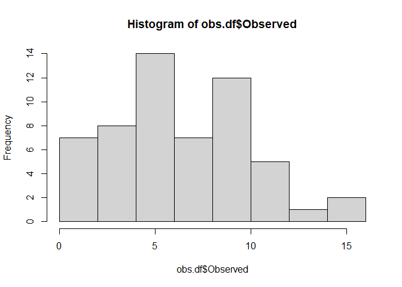<!-- -->

    ## 
    ##  Shapiro-Wilk normality test
    ## 
    ## data:  obs.df$Observed
    ## W = 0.96866, p-value = 0.1525

``` r
var.test(Observed ~ interval, obs.df) # the variance in the two groups is not significantly different from each other
```

    ## 
    ##  F test to compare two variances
    ## 
    ## data:  Observed by interval
    ## F = 1.1459, num df = 19, denom df = 35, p-value = 0.7063
    ## alternative hypothesis: true ratio of variances is not equal to 1
    ## 95 percent confidence interval:
    ##  0.5353907 2.7034296
    ## sample estimates:
    ## ratio of variances 
    ##           1.145871

``` r
mod1=t.test(Observed ~ interval, obs.df, var.equal=TRUE)
si=obs.df %>% 
  filter(interval=="single"); sd(si$Observed)
```

    ## [1] 3.405877

``` r
db=obs.df %>% 
  filter(interval=="double"); sd(db$Observed)
```

    ## [1] 3.645834

``` r
# make a nice boxplot to go with the results:
fig3.a.p=obs.df %>% 
  ggplot(aes(x=interval, y=Observed, 
             fill=interval)) + 
  geom_boxplot(alpha = 0.6) + 
  scale_fill_manual(values = c("chartreuse2", 
                               "steelblue1")) +
  theme_classic() + 
  ylab("Observed species richness") +
  scale_x_discrete(labels = c("Double", 
                              "Single")) +
  theme(legend.position = "none") +
  labs(title = "A.", 
       subtitle = "Plants") +
  xlab("Soil sample volume") +
  annotate(geom = "text", 
           x=1.5, 
           y=15, 
           label = paste0("P = ",
                          round(mod1$p.value, 
                                digits = 3)), # annotate rho and p-value
           fontface = "italic", 
           size=3, 
           color="black", 
           hjust=0); fig3.a.p
```

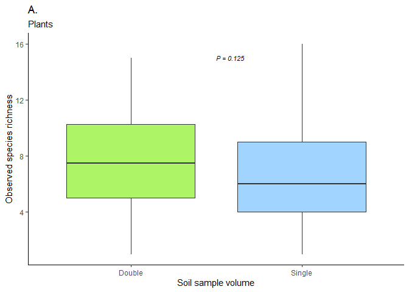<!-- -->

to go along with the results about pots sampled twice, we’re interested
in the overall recapture rate of the species that were identified in
pots sampled twice. i.e., were species identified consistently in both
samples from the pots they were identified in? or rather, was two
samples (or increased volume) necessary for identifying certain species
in many pots?

``` r
# we will make two species-by-pot matrices with presence/absence (1/0) data, one 
# for the first samples in every pot and one for the second pot. we'll then merge
# the two matrices, leaving every cell with 0, 1, or 2 identifications per species
# per pot. for every pot, each species will then be
#
#       0 = not identified 
#       1 = identified in one sample
#       2 = identified in both samples
# 
# this will make it easy for us to examine the recapture rate of the different species. 

twice = subset_samples(plants, interval == "double"); twice # subset pots sampled twice
```

    ## phyloseq-class experiment-level object
    ## otu_table()   OTU Table:         [ 85 taxa and 40 samples ]
    ## sample_data() Sample Data:       [ 40 samples by 6 sample variables ]
    ## tax_table()   Taxonomy Table:    [ 85 taxa by 6 taxonomic ranks ]
    ## refseq()      DNAStringSet:      [ 85 reference sequences ]

``` r
first = subset_samples(twice, grepl(pattern = "_1", # subset first samples
                                    x = twice@sam_data$sample_id)); first = prune_taxa(taxa_sums(first)>0,
                                                                                       first); first
```

    ## phyloseq-class experiment-level object
    ## otu_table()   OTU Table:         [ 36 taxa and 20 samples ]
    ## sample_data() Sample Data:       [ 20 samples by 6 sample variables ]
    ## tax_table()   Taxonomy Table:    [ 36 taxa by 6 taxonomic ranks ]
    ## refseq()      DNAStringSet:      [ 36 reference sequences ]

``` r
first@sam_data$turn = "first"; head(first@sam_data) # assign variable to distinguish from "second" samples
```

    ##                              sample container  host sample_id pot_id interval
    ## PLANTEIMP_21_001_ITS_S2_ITS4    001         2 Taxus       1_1     p1   double
    ## PLANTEIMP_21_003_ITS_S2_ITS4    003         2 Taxus       2_1     p2   double
    ## PLANTEIMP_21_005_ITS_S2_ITS4    005         2 Taxus       3_1     p3   double
    ## PLANTEIMP_21_007_ITS_S2_ITS4    007         2 Taxus       4_1     p4   double
    ## PLANTEIMP_21_009_ITS_S2_ITS4    009         2 Taxus       5_1     p5   double
    ## PLANTEIMP_21_021_ITS_S2_ITS4    021         2 Thuja       1_1    p16   double
    ##                               turn
    ## PLANTEIMP_21_001_ITS_S2_ITS4 first
    ## PLANTEIMP_21_003_ITS_S2_ITS4 first
    ## PLANTEIMP_21_005_ITS_S2_ITS4 first
    ## PLANTEIMP_21_007_ITS_S2_ITS4 first
    ## PLANTEIMP_21_009_ITS_S2_ITS4 first
    ## PLANTEIMP_21_021_ITS_S2_ITS4 first

``` r
first@sam_data$row = paste0(first@sam_data$pot_id, # pot ID
                            "_",                   # _
                            first@sam_data$turn)   # turn

second = subset_samples(twice, grepl(pattern = "_2", # second samples
                                    x = twice@sam_data$sample_id)); second = prune_taxa(taxa_sums(second)>0,
                                                                                        second); second
```

    ## phyloseq-class experiment-level object
    ## otu_table()   OTU Table:         [ 38 taxa and 20 samples ]
    ## sample_data() Sample Data:       [ 20 samples by 6 sample variables ]
    ## tax_table()   Taxonomy Table:    [ 38 taxa by 6 taxonomic ranks ]
    ## refseq()      DNAStringSet:      [ 38 reference sequences ]

``` r
second@sam_data$turn = "second"; head(second@sam_data)
```

    ##                              sample container  host sample_id pot_id interval
    ## PLANTEIMP_21_002_ITS_S2_ITS4    002         2 Taxus       1_2     p1   double
    ## PLANTEIMP_21_004_ITS_S2_ITS4    004         2 Taxus       2_2     p2   double
    ## PLANTEIMP_21_006_ITS_S2_ITS4    006         2 Taxus       3_2     p3   double
    ## PLANTEIMP_21_008_ITS_S2_ITS4    008         2 Taxus       4_2     p4   double
    ## PLANTEIMP_21_010_ITS_S2_ITS4    010         2 Taxus       5_2     p5   double
    ## PLANTEIMP_21_022_ITS_S2_ITS4    022         2 Thuja       1_2    p16   double
    ##                                turn
    ## PLANTEIMP_21_002_ITS_S2_ITS4 second
    ## PLANTEIMP_21_004_ITS_S2_ITS4 second
    ## PLANTEIMP_21_006_ITS_S2_ITS4 second
    ## PLANTEIMP_21_008_ITS_S2_ITS4 second
    ## PLANTEIMP_21_010_ITS_S2_ITS4 second
    ## PLANTEIMP_21_022_ITS_S2_ITS4 second

``` r
second@sam_data$row = paste0(second@sam_data$pot_id, # pot ID
                             "_",                    # _
                             second@sam_data$turn)   # turn

twice = merge_phyloseq(first, 
                       second); twice # merge back together
```

    ## phyloseq-class experiment-level object
    ## otu_table()   OTU Table:         [ 49 taxa and 40 samples ]
    ## sample_data() Sample Data:       [ 40 samples by 8 sample variables ]
    ## tax_table()   Taxonomy Table:    [ 49 taxa by 6 taxonomic ranks ]
    ## refseq()      DNAStringSet:      [ 49 reference sequences ]

``` r
sample_names(twice) = twice@sam_data$row; head(twice@sam_data) # assign the new sample names
```

    ##           sample container  host sample_id pot_id interval  turn       row
    ## p1_first     001         2 Taxus       1_1     p1   double first  p1_first
    ## p2_first     003         2 Taxus       2_1     p2   double first  p2_first
    ## p3_first     005         2 Taxus       3_1     p3   double first  p3_first
    ## p4_first     007         2 Taxus       4_1     p4   double first  p4_first
    ## p5_first     009         2 Taxus       5_1     p5   double first  p5_first
    ## p16_first    021         2 Thuja       1_1    p16   double first p16_first

``` r
colnames(twice@otu_table) = twice@tax_table[,6]

# now we make the new data frame with presence/absence data:
pres.abs.df = data.frame(twice@otu_table) %>% 
  mutate_if(is.numeric, ~1 * (. > 0)) 

pres.abs.df.t = data.frame(t(pres.abs.df)) # transpose to make pots columns

# split first and second samples and clean up the colnames before summarizing:
first = data.frame(pres.abs.df.t) %>% 
  select(matches("_first"))
colnames(first) = sub("_first", "", colnames(first))

second = data.frame(pres.abs.df.t) %>% 
  select(matches("_second"))
colnames(second) = sub("_second", "", colnames(second))

# by summarizing the two data frames, we'll be able to see if species were identified
# 0, 1, or 2 times per pot:
pres.abs.df.fin = data.frame(first+second)

# this is where you find the overall recapture rate of 70.3 % --- that does not add up....
# the recapture rate has to be the number of 2 divided by the number of 1s + 2s
table(pres.abs.df.fin==0) # 175 identifications in total (i.e. != 0)
```

    ## 
    ## FALSE  TRUE 
    ##   175   805

``` r
table(pres.abs.df.fin==1) # species X was identified in only one sample per pot a total of 123 times
```

    ## 
    ## FALSE  TRUE 
    ##   857   123

``` r
table(pres.abs.df.fin==2) # species X was identified in both samples per pot a total of 52 times
```

    ## 
    ## FALSE  TRUE 
    ##   928    52

``` r
# check recapture rate for two known alien species to Norway:
con = pres.abs.df.fin["Erigeron_canadensis",] # E. canadensis is synonymous to Conyza canadensis
table(con==0) 
```

    ## 
    ## FALSE  TRUE 
    ##     9    11

``` r
table(con==1) 
```

    ## 
    ## FALSE  TRUE 
    ##    14     6

``` r
table(con==2)
```

    ## 
    ## FALSE  TRUE 
    ##    17     3

``` r
acer = pres.abs.df.fin[rownames(pres.abs.df.fin) %in% "Acer_pseudoplatanus", ]
acer = pres.abs.df.fin["Acer_pseudoplatanus",]
table(acer==0) 
```

    ## 
    ## FALSE  TRUE 
    ##     5    15

``` r
table(acer==1) 
```

    ## 
    ## FALSE  TRUE 
    ##    16     4

``` r
table(acer==2)
```

    ## 
    ## FALSE  TRUE 
    ##    19     1

2.  next we want to calculate the fold increase in species richness per
    pot when increasing from one to two samples. to do this we will only
    use data from pots sampled twice. FI = fold increase, S = sample,
    Obs = observed species richness: FI = (Obs S1 + Obs S2) / Obs S1

``` r
twice = subset_samples(plants, interval == "double"); twice = prune_taxa(taxa_sums(twice)>0,
                                                                         twice); twice
```

    ## phyloseq-class experiment-level object
    ## otu_table()   OTU Table:         [ 49 taxa and 40 samples ]
    ## sample_data() Sample Data:       [ 40 samples by 6 sample variables ]
    ## tax_table()   Taxonomy Table:    [ 49 taxa by 6 taxonomic ranks ]
    ## refseq()      DNAStringSet:      [ 49 reference sequences ]

``` r
first = subset_samples(twice, grepl(pattern = "_1", 
                                    x = twice@sam_data$sample_id)); first = prune_taxa(taxa_sums(first)>0,
                                                                                       first); first
```

    ## phyloseq-class experiment-level object
    ## otu_table()   OTU Table:         [ 36 taxa and 20 samples ]
    ## sample_data() Sample Data:       [ 20 samples by 6 sample variables ]
    ## tax_table()   Taxonomy Table:    [ 36 taxa by 6 taxonomic ranks ]
    ## refseq()      DNAStringSet:      [ 36 reference sequences ]

``` r
first@sam_data$turn = "first"; head(first@sam_data) # add a variable to distinguish between first and merged samples
```

    ##                              sample container  host sample_id pot_id interval
    ## PLANTEIMP_21_001_ITS_S2_ITS4    001         2 Taxus       1_1     p1   double
    ## PLANTEIMP_21_003_ITS_S2_ITS4    003         2 Taxus       2_1     p2   double
    ## PLANTEIMP_21_005_ITS_S2_ITS4    005         2 Taxus       3_1     p3   double
    ## PLANTEIMP_21_007_ITS_S2_ITS4    007         2 Taxus       4_1     p4   double
    ## PLANTEIMP_21_009_ITS_S2_ITS4    009         2 Taxus       5_1     p5   double
    ## PLANTEIMP_21_021_ITS_S2_ITS4    021         2 Thuja       1_1    p16   double
    ##                               turn
    ## PLANTEIMP_21_001_ITS_S2_ITS4 first
    ## PLANTEIMP_21_003_ITS_S2_ITS4 first
    ## PLANTEIMP_21_005_ITS_S2_ITS4 first
    ## PLANTEIMP_21_007_ITS_S2_ITS4 first
    ## PLANTEIMP_21_009_ITS_S2_ITS4 first
    ## PLANTEIMP_21_021_ITS_S2_ITS4 first

``` r
second = merge_samples(twice, group = "pot_id"); second 
```

    ## Warning in asMethod(object): NAs introduced by coercion

    ## Warning in asMethod(object): NAs introduced by coercion

    ## Warning in asMethod(object): NAs introduced by coercion

    ## Warning in asMethod(object): NAs introduced by coercion

    ## phyloseq-class experiment-level object
    ## otu_table()   OTU Table:         [ 49 taxa and 20 samples ]
    ## sample_data() Sample Data:       [ 20 samples by 6 sample variables ]
    ## tax_table()   Taxonomy Table:    [ 49 taxa by 6 taxonomic ranks ]

``` r
# reassign sample data in second:
second@sam_data$pot_id = rownames(second@sam_data) # fix pot_id variable
second@sam_data$pot_id = sub("p","", second@sam_data$pot_id) 
second@sam_data$pot_id = as.numeric(second@sam_data$pot_id) # this will let us sort by pot_id
second.sam = data.frame(second@sam_data) %>%  # using arrange() in dplyr
  arrange(pot_id) %>%
  mutate(pot_id=paste0("p",pot_id)); head(second.sam); tail(second.sam)
```

    ##     sample container host sample_id pot_id interval
    ## p1     1.5         2   NA        NA     p1       NA
    ## p2     3.5         2   NA        NA     p2       NA
    ## p3     5.5         2   NA        NA     p3       NA
    ## p4     7.5         2   NA        NA     p4       NA
    ## p5     9.5         2   NA        NA     p5       NA
    ## p16   21.5         2   NA        NA    p16       NA

    ##     sample container host sample_id pot_id interval
    ## p35   49.5         1   NA        NA    p35       NA
    ## p46   61.5         1   NA        NA    p46       NA
    ## p47   63.5         1   NA        NA    p47       NA
    ## p48   65.5         1   NA        NA    p48       NA
    ## p49   67.5         1   NA        NA    p49       NA
    ## p50   69.5         1   NA        NA    p50       NA

``` r
# now make an identical dataframe to get variables from: 
sam = data.frame(twice@sam_data) 
sam = sam %>%
  filter(grepl(pattern = "_2", 
               sam$sample_id))

# and reassign variables: 
second.sam$host = sam$host
second.sam$container = sam$container
second.sam$interval = sam$interval
second.sam$turn = "second"; # add a variable to distinguish between merged and first samples

# convert til sample_data() object:
second.sam = sample_data(second.sam); sample_names(second.sam)
```

    ##  [1] "p1"  "p2"  "p3"  "p4"  "p5"  "p16" "p17" "p18" "p19" "p20" "p31" "p32"
    ## [13] "p33" "p34" "p35" "p46" "p47" "p48" "p49" "p50"

``` r
# and reassign to twice.m phyloseq object: 
sample_data(second) = second.sam; twice.m; head(second@sam_data)
```

    ## phyloseq-class experiment-level object
    ## otu_table()   OTU Table:         [ 85 taxa and 20 samples ]
    ## sample_data() Sample Data:       [ 20 samples by 6 sample variables ]
    ## tax_table()   Taxonomy Table:    [ 85 taxa by 6 taxonomic ranks ]

    ##     sample container  host sample_id pot_id interval   turn
    ## p1     1.5         2 Taxus        NA     p1   double second
    ## p16   21.5         2 Thuja        NA    p16   double second
    ## p17   23.5         2 Thuja        NA    p17   double second
    ## p18   25.5         2 Thuja        NA    p18   double second
    ## p19   27.5         2 Thuja        NA    p19   double second
    ## p2     3.5         2 Taxus        NA     p2   double second

``` r
# now we can merge the two phyloseq objects in order to normalize them:
fiphy = merge_phyloseq(first, second); fiphy
```

    ## phyloseq-class experiment-level object
    ## otu_table()   OTU Table:         [ 36 taxa and 40 samples ]
    ## sample_data() Sample Data:       [ 40 samples by 7 sample variables ]
    ## tax_table()   Taxonomy Table:    [ 36 taxa by 6 taxonomic ranks ]
    ## refseq()      DNAStringSet:      [ 36 reference sequences ]

``` r
# normalize the new phyloseq object:
sort(sample_sums(fiphy)) # we can normalize at the lowest read depth to keep all samples and only lose two taxa:
```

    ## PLANTEIMP_21_021_ITS_S2_ITS4 PLANTEIMP_21_029_ITS_S2_ITS4 
    ##                        10378                        17368 
    ##                          p16 PLANTEIMP_21_063_ITS_S2_ITS4 
    ##                        19007                        25009 
    ## PLANTEIMP_21_067_ITS_S2_ITS4                          p20 
    ##                        30585                        36323 
    ## PLANTEIMP_21_027_ITS_S2_ITS4 PLANTEIMP_21_061_ITS_S2_ITS4 
    ##                        45332                        47137 
    ##                          p46 PLANTEIMP_21_065_ITS_S2_ITS4 
    ##                        47137                        56796 
    ##                          p48 PLANTEIMP_21_025_ITS_S2_ITS4 
    ##                        72443                        73096 
    ##                          p49 PLANTEIMP_21_069_ITS_S2_ITS4 
    ##                        77475                        80842 
    ##                          p19 PLANTEIMP_21_043_ITS_S2_ITS4 
    ##                        89241                        98559 
    ##                          p47 PLANTEIMP_21_001_ITS_S2_ITS4 
    ##                       108698                       126850 
    ##                          p32 PLANTEIMP_21_009_ITS_S2_ITS4 
    ##                       140392                       145399 
    ## PLANTEIMP_21_047_ITS_S2_ITS4                          p50 
    ##                       159537                       209234 
    ##                          p18 PLANTEIMP_21_049_ITS_S2_ITS4 
    ##                       236869                       276068 
    ## PLANTEIMP_21_003_ITS_S2_ITS4 PLANTEIMP_21_023_ITS_S2_ITS4 
    ##                       299410                       300847 
    ##                          p17 PLANTEIMP_21_041_ITS_S2_ITS4 
    ##                       318731                       342859 
    ## PLANTEIMP_21_005_ITS_S2_ITS4                           p2 
    ##                       404503                       468264 
    ## PLANTEIMP_21_007_ITS_S2_ITS4 PLANTEIMP_21_045_ITS_S2_ITS4 
    ##                       622272                       630913 
    ##                           p1                          p35 
    ##                       646324                       678866 
    ##                          p34                          p31 
    ##                       697315                       752208 
    ##                           p5                           p3 
    ##                       761806                       937068 
    ##                          p33                           p4 
    ##                       993917                      1011932

``` r
fiphyrar = rarefy_even_depth(fiphy, 
                             rngseed = 123, 
                             replace = FALSE, 
                             trimOTUs = TRUE, 
                             sample.size = 10378); fiphy; fiphyrar
```

    ## `set.seed(123)` was used to initialize repeatable random subsampling.

    ## Please record this for your records so others can reproduce.

    ## Try `set.seed(123); .Random.seed` for the full vector

    ## ...

    ## 2OTUs were removed because they are no longer 
    ## present in any sample after random subsampling

    ## ...

    ## phyloseq-class experiment-level object
    ## otu_table()   OTU Table:         [ 36 taxa and 40 samples ]
    ## sample_data() Sample Data:       [ 40 samples by 7 sample variables ]
    ## tax_table()   Taxonomy Table:    [ 36 taxa by 6 taxonomic ranks ]
    ## refseq()      DNAStringSet:      [ 36 reference sequences ]

    ## phyloseq-class experiment-level object
    ## otu_table()   OTU Table:         [ 34 taxa and 40 samples ]
    ## sample_data() Sample Data:       [ 40 samples by 7 sample variables ]
    ## tax_table()   Taxonomy Table:    [ 34 taxa by 6 taxonomic ranks ]
    ## refseq()      DNAStringSet:      [ 34 reference sequences ]

``` r
# now we have to separate the new object into two dataframes before we combine
# them to calculate and plot fold increase: 
first = subset_samples(fiphyrar, turn=="first")
first.df = data.frame(cbind(estimate_richness(first, 
                                              measures = "Observed"),
                            first@sam_data)) %>% 
  rename("obs_first"="Observed",
         "pot_id_first"="pot_id",
         "turn_first"="turn") %>% 
  mutate(pot_id=pot_id_first); head(first.df)
```

    ##                              obs_first sample container  host sample_id
    ## PLANTEIMP_21_001_ITS_S2_ITS4         5    001         2 Taxus       1_1
    ## PLANTEIMP_21_003_ITS_S2_ITS4         6    003         2 Taxus       2_1
    ## PLANTEIMP_21_005_ITS_S2_ITS4        10    005         2 Taxus       3_1
    ## PLANTEIMP_21_007_ITS_S2_ITS4        10    007         2 Taxus       4_1
    ## PLANTEIMP_21_009_ITS_S2_ITS4         7    009         2 Taxus       5_1
    ## PLANTEIMP_21_021_ITS_S2_ITS4         5    021         2 Thuja       1_1
    ##                              pot_id_first interval turn_first pot_id
    ## PLANTEIMP_21_001_ITS_S2_ITS4           p1   double      first     p1
    ## PLANTEIMP_21_003_ITS_S2_ITS4           p2   double      first     p2
    ## PLANTEIMP_21_005_ITS_S2_ITS4           p3   double      first     p3
    ## PLANTEIMP_21_007_ITS_S2_ITS4           p4   double      first     p4
    ## PLANTEIMP_21_009_ITS_S2_ITS4           p5   double      first     p5
    ## PLANTEIMP_21_021_ITS_S2_ITS4          p16   double      first    p16

``` r
second = subset_samples(fiphyrar, turn=="second")
second.df = data.frame(cbind(estimate_richness(second, 
                                              measures = "Observed"),
                            second@sam_data)) %>% 
  rename("obs_second"="Observed",
         "pot_id_second"="pot_id",
         "turn_second"="turn") %>% 
  mutate(pot_id=pot_id_second); head(second.df)
```

    ##     obs_second sample container  host sample_id pot_id_second interval
    ## p1           9    1.5         2 Taxus      <NA>            p1   double
    ## p16          5   21.5         2 Thuja      <NA>           p16   double
    ## p17          7   23.5         2 Thuja      <NA>           p17   double
    ## p18          8   25.5         2 Thuja      <NA>           p18   double
    ## p19          9   27.5         2 Thuja      <NA>           p19   double
    ## p2           9    3.5         2 Taxus      <NA>            p2   double
    ##     turn_second pot_id
    ## p1       second     p1
    ## p16      second    p16
    ## p17      second    p17
    ## p18      second    p18
    ## p19      second    p19
    ## p2       second     p2

``` r
fidf = full_join(first.df, second.df, by = "pot_id") %>% 
  select("obs_first", "obs_second", 
         "pot_id", "pot_id_first", "pot_id_second", 
         "turn_first", "turn_second")

fidf = fidf %>% 
  mutate(foldincrease = obs_second/obs_first)
fig3.b.p=ggplot(fidf, aes(x=reorder(pot_id, -foldincrease), 
                 y=foldincrease,
                 fill="darkolivegreen1", color="black")) + 
  geom_col(width=1) +
  scale_fill_manual(values = "darkolivegreen1") +
  scale_color_manual(values = "black") +
  theme_classic() +
  theme(legend.position = "none", 
        axis.ticks.x = element_blank()
      ) + 
  ylab("Fold increase") +
  xlab("Sampled pots") +
  scale_x_discrete(labels = paste0(rep(" ", times=20))) +
  labs(title = "B.",
       subtitle = "Plants") +
  annotate(geom = "text", 
           x=5, 
           y=2.5, 
           label = paste0("Median = ", 
                         round(median(fidf$foldincrease), 
                               digits = 2)), # calculate and annotate manually...
           fontface = "italic", 
           size=3, 
           color="black", 
           hjust=0) +
  scale_y_continuous(breaks = seq(0, 3, 0.5), limits = c(0, 3)) + 
  coord_cartesian(ylim = c(0.9, 3)); fig3.b.p
```

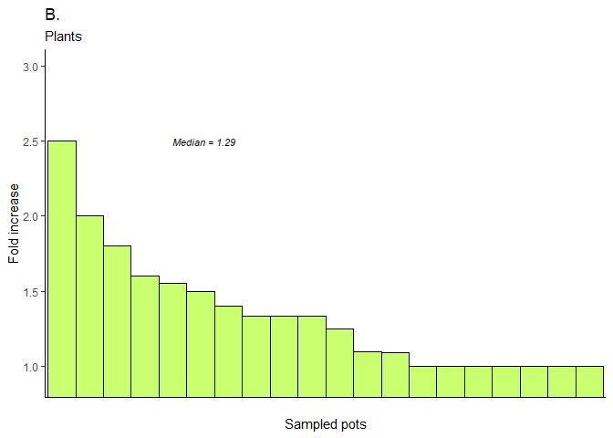<!-- -->

``` r
# additionally, we will investigate whether there is a correlation between 
# the richness in the second sample and fold increase for each pot:
cormod = cor.test(fidf$foldincrease, fidf$obs_second, 
         method = "pearson")
fig3.c.p=ggplot(fidf, aes(x=obs_second, 
                 y=foldincrease,
                 fill="darkolivegreen1")) + 
  theme_classic() +
  theme(legend.position = "none", 
        ) +
  scale_color_manual(values = "black") + 
  scale_fill_manual(values = "darkolivegreen1") +
  geom_point(size=6, pch=21) + 
  geom_smooth(method = "lm", 
              color="black", 
              fill="grey90") +
  scale_x_continuous(breaks = seq(0, 20, 5)) +
  scale_y_continuous(breaks = seq(0, 4, 0.5), 
                    limits = c(0, 3.6)) +
  xlab("Richness in both samples") +
  ylab("\nFold increase") + 
  labs(title = "C.",
       subtitle = "Plants") +
  coord_cartesian(ylim = c(1,3)) + 
  annotate(geom = "text", 
           x=8.8, 
           y=2.8, 
           label = paste0("r = ", 
                          round(cormod$estimate, 
                                digits = 3),
                          "\nP = ",
                          round(cormod$p.value,
                                digits = 3)), 
           fontface = "italic", size=3, color="black", 
           hjust = 0); fig3.c.p
```

    ## `geom_smooth()` using formula = 'y ~ x'

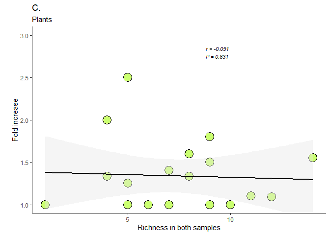<!-- -->

we now run the three previous chunks for fungi:

1.  soil volume:

``` r
# we're going to merge samples from the same pots. to do this, we first create a 
# new phyloseq object with only the samples we're going to merge: 
twice = subset_samples(fungi, interval == "double"); twice
```

    ## phyloseq-class experiment-level object
    ## otu_table()   OTU Table:         [ 4618 taxa and 40 samples ]
    ## sample_data() Sample Data:       [ 40 samples by 6 sample variables ]
    ## tax_table()   Taxonomy Table:    [ 4618 taxa by 7 taxonomic ranks ]
    ## refseq()      DNAStringSet:      [ 4618 reference sequences ]

``` r
twice.m = merge_samples(twice, group = "pot_id"); twice.m 
```

    ## Warning in asMethod(object): NAs introduced by coercion

    ## Warning in asMethod(object): NAs introduced by coercion

    ## Warning in asMethod(object): NAs introduced by coercion

    ## Warning in asMethod(object): NAs introduced by coercion

    ## phyloseq-class experiment-level object
    ## otu_table()   OTU Table:         [ 4618 taxa and 20 samples ]
    ## sample_data() Sample Data:       [ 20 samples by 6 sample variables ]
    ## tax_table()   Taxonomy Table:    [ 4618 taxa by 7 taxonomic ranks ]

``` r
# reassign sample data in twice.m:
twice.m@sam_data$pot_id = rownames(twice.m@sam_data) # fix pot_id variable
twice.m@sam_data$pot_id = sub("p","",twice.m@sam_data$pot_id) 
twice.m@sam_data$pot_id = as.numeric(twice.m@sam_data$pot_id) # this will let us sort by pot_id
twice.m.sam = data.frame(twice.m@sam_data) %>%  # using arrange() in dplyr
  arrange(pot_id) %>%
  mutate(pot_id=paste0("p",pot_id))

# now make an identical dataframe to get variables from: 
sam = data.frame(twice@sam_data) 
sam = sam %>%
  filter(sample_id!="1_2") %>%
  filter(sample_id!="2_2") %>%
  filter(sample_id!="3_2") %>%
  filter(sample_id!="4_2") %>%
  filter(sample_id!="5_2")

# and reassign variables: 
twice.m.sam$host = sam$host
twice.m.sam$container = sam$container
twice.m.sam$interval = sam$interval

# convert til sample_data() object:
twice.m.sam = sample_data(twice.m.sam); sample_names(twice.m.sam)
```

    ##  [1] "p1"  "p2"  "p3"  "p4"  "p5"  "p16" "p17" "p18" "p19" "p20" "p31" "p32"
    ## [13] "p33" "p34" "p35" "p46" "p47" "p48" "p49" "p50"

``` r
# and reassign to twice.m phyloseq object: 
sample_data(twice.m) = twice.m.sam; twice.m; head(twice.m@sam_data)
```

    ## phyloseq-class experiment-level object
    ## otu_table()   OTU Table:         [ 4618 taxa and 20 samples ]
    ## sample_data() Sample Data:       [ 20 samples by 6 sample variables ]
    ## tax_table()   Taxonomy Table:    [ 4618 taxa by 7 taxonomic ranks ]

    ##     sample container  host sample_id pot_id interval
    ## p1     1.5         2 Taxus        NA     p1   double
    ## p16   21.5         2 Thuja        NA    p16   double
    ## p17   23.5         2 Thuja        NA    p17   double
    ## p18   25.5         2 Thuja        NA    p18   double
    ## p19   27.5         2 Thuja        NA    p19   double
    ## p2     3.5         2 Taxus        NA     p2   double

``` r
# now we want to get the merged samples back in the original dataset. we first
# create a new dataset with only samples from pots sampled once: 
once = subset_samples(fungi, interval == "single"); once
```

    ## phyloseq-class experiment-level object
    ## otu_table()   OTU Table:         [ 4618 taxa and 40 samples ]
    ## sample_data() Sample Data:       [ 40 samples by 6 sample variables ]
    ## tax_table()   Taxonomy Table:    [ 4618 taxa by 7 taxonomic ranks ]
    ## refseq()      DNAStringSet:      [ 4618 reference sequences ]

``` r
# and now we can merge the two phyloseq objects:
fungi2 = merge_phyloseq(twice.m, once); fungi2
```

    ## phyloseq-class experiment-level object
    ## otu_table()   OTU Table:         [ 4618 taxa and 60 samples ]
    ## sample_data() Sample Data:       [ 60 samples by 6 sample variables ]
    ## tax_table()   Taxonomy Table:    [ 4618 taxa by 7 taxonomic ranks ]
    ## refseq()      DNAStringSet:      [ 4618 reference sequences ]

``` r
sort(sample_sums(fungi2))
```

    ## PLANTEIMP_21_051_fITS7_ITS4 PLANTEIMP_21_014_fITS7_ITS4 
    ##                      237829                      262481 
    ## PLANTEIMP_21_011_fITS7_ITS4 PLANTEIMP_21_078_fITS7_ITS4 
    ##                      281225                      284237 
    ## PLANTEIMP_21_071_fITS7_ITS4 PLANTEIMP_21_037_fITS7_ITS4 
    ##                      294628                      309145 
    ## PLANTEIMP_21_036_fITS7_ITS4 PLANTEIMP_21_032_fITS7_ITS4 
    ##                      329037                      334323 
    ## PLANTEIMP_21_038_fITS7_ITS4 PLANTEIMP_21_055_fITS7_ITS4 
    ##                      348740                      358571 
    ## PLANTEIMP_21_074_fITS7_ITS4 PLANTEIMP_21_015_fITS7_ITS4 
    ##                      359494                      388647 
    ## PLANTEIMP_21_019_fITS7_ITS4                         p47 
    ##                      392826                      393031 
    ## PLANTEIMP_21_016_fITS7_ITS4 PLANTEIMP_21_031_fITS7_ITS4 
    ##                      395374                      398481 
    ## PLANTEIMP_21_052_fITS7_ITS4 PLANTEIMP_21_018_fITS7_ITS4 
    ##                      400436                      406155 
    ## PLANTEIMP_21_077_fITS7_ITS4 PLANTEIMP_21_017_fITS7_ITS4 
    ##                      410094                      412759 
    ## PLANTEIMP_21_075_fITS7_ITS4 PLANTEIMP_21_057_fITS7_ITS4 
    ##                      414955                      433953 
    ## PLANTEIMP_21_013_fITS7_ITS4 PLANTEIMP_21_072_fITS7_ITS4 
    ##                      436529                      459504 
    ## PLANTEIMP_21_060_fITS7_ITS4                          p3 
    ##                      466103                      510952 
    ## PLANTEIMP_21_073_fITS7_ITS4 PLANTEIMP_21_059_fITS7_ITS4 
    ##                      519138                      533051 
    ## PLANTEIMP_21_080_fITS7_ITS4 PLANTEIMP_21_033_fITS7_ITS4 
    ##                      551936                      560971 
    ## PLANTEIMP_21_056_fITS7_ITS4 PLANTEIMP_21_034_fITS7_ITS4 
    ##                      571726                      579099 
    ##                          p5 PLANTEIMP_21_012_fITS7_ITS4 
    ##                      595117                      604818 
    ##                         p46 PLANTEIMP_21_035_fITS7_ITS4 
    ##                      609097                      613051 
    ## PLANTEIMP_21_040_fITS7_ITS4 PLANTEIMP_21_020_fITS7_ITS4 
    ##                      667798                      668632 
    ## PLANTEIMP_21_058_fITS7_ITS4                         p48 
    ##                      697051                      704061 
    ## PLANTEIMP_21_054_fITS7_ITS4 PLANTEIMP_21_076_fITS7_ITS4 
    ##                      743049                      745844 
    ##                         p32 PLANTEIMP_21_053_fITS7_ITS4 
    ##                      746883                      794732 
    ##                         p50                         p33 
    ##                      869384                      869998 
    ##                         p19                         p17 
    ##                      935391                      944664 
    ##                         p31                          p2 
    ##                      984302                     1066219 
    ## PLANTEIMP_21_039_fITS7_ITS4                         p35 
    ##                     1251196                     1257923 
    ## PLANTEIMP_21_079_fITS7_ITS4                         p18 
    ##                     1290324                     1319057 
    ##                          p4                         p16 
    ##                     1322093                     1338936 
    ##                         p34                          p1 
    ##                     1344452                     1399624 
    ##                         p49                         p20 
    ##                     1465113                     1621620

``` r
f2rar = rarefy_even_depth(fungi2, 
                          rngseed = 123, 
                          replace = FALSE, 
                          trimOTUs = TRUE, 
                          sample.size = 237829); fungi2; f2rar
```

    ## `set.seed(123)` was used to initialize repeatable random subsampling.

    ## Please record this for your records so others can reproduce.

    ## Try `set.seed(123); .Random.seed` for the full vector

    ## ...

    ## 150OTUs were removed because they are no longer 
    ## present in any sample after random subsampling

    ## ...

    ## phyloseq-class experiment-level object
    ## otu_table()   OTU Table:         [ 4618 taxa and 60 samples ]
    ## sample_data() Sample Data:       [ 60 samples by 6 sample variables ]
    ## tax_table()   Taxonomy Table:    [ 4618 taxa by 7 taxonomic ranks ]
    ## refseq()      DNAStringSet:      [ 4618 reference sequences ]

    ## phyloseq-class experiment-level object
    ## otu_table()   OTU Table:         [ 4468 taxa and 60 samples ]
    ## sample_data() Sample Data:       [ 60 samples by 6 sample variables ]
    ## tax_table()   Taxonomy Table:    [ 4468 taxa by 7 taxonomic ranks ]
    ## refseq()      DNAStringSet:      [ 4468 reference sequences ]

``` r
# now we're ready to have a look at observed species richness:
# make a dataframe for ease of testing and plotting:
obs.df = data.frame(cbind(estimate_richness(f2rar, 
                                            measures = "Observed"), 
                          sample_data(f2rar))); str(obs.df)
```

    ## 'data.frame':    60 obs. of  7 variables:
    ##  $ Observed : num  767 534 688 745 689 882 657 757 828 708 ...
    ##  $ sample   : chr  "1.5" "21.5" "23.5" "25.5" ...
    ##  $ container: chr  "2" "2" "2" "2" ...
    ##  $ host     : chr  "Taxus" "Thuja" "Thuja" "Thuja" ...
    ##  $ sample_id: chr  NA NA NA NA ...
    ##  $ pot_id   : chr  "p1" "p16" "p17" "p18" ...
    ##  $ interval : chr  "double" "double" "double" "double" ...

``` r
hist(obs.df$Observed); shapiro.test(obs.df$Observed) # not statistically significantly different from a normal distribution...
```

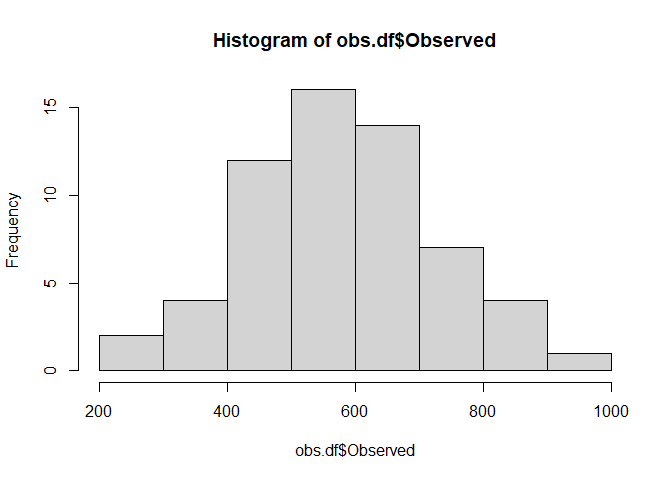<!-- -->

    ## 
    ##  Shapiro-Wilk normality test
    ## 
    ## data:  obs.df$Observed
    ## W = 0.98709, p-value = 0.7773

``` r
var.test(Observed ~ interval, obs.df) # the variance in the two groups is not significantly different from each other
```

    ## 
    ##  F test to compare two variances
    ## 
    ## data:  Observed by interval
    ## F = 1.228, num df = 19, denom df = 39, p-value = 0.5715
    ## alternative hypothesis: true ratio of variances is not equal to 1
    ## 95 percent confidence interval:
    ##  0.5859001 2.8707593
    ## sample estimates:
    ## ratio of variances 
    ##           1.228033

``` r
mod1=t.test(Observed ~ interval, 
            obs.df, var.equal=TRUE)
si=obs.df %>% 
  filter(interval=="single"); sd(si$Observed)
```

    ## [1] 119.251

``` r
db=obs.df %>% 
  filter(interval=="double"); sd(db$Observed)
```

    ## [1] 132.15

``` r
# make a nice boxplot to go with the results:
fig3.a.f=obs.df %>% 
  ggplot(aes(x=interval, y=Observed, 
             fill=interval)) + 
  geom_boxplot(alpha = 0.6) + 
  scale_fill_manual(values = c("tan1", 
                               "gold1")) +
  theme_classic() + 
  ylab("Observed species richness") +
  scale_x_discrete(labels = c("Double", 
                              "Single")) +
  theme(legend.position = "none") +
  labs(title = " ", 
       subtitle = "Fungi") +
  xlab("Soil sample volume") +
  annotate(geom = "text", 
           x=1.5, 
           y=850, 
           label = paste0("P = <",
                          round(mod1$p.value, 
                                digits = 3),
                          ".001"), # annotate rho and p-value
           fontface = "italic", 
           size=3, 
           color="black", 
           hjust=0); fig3.a.f
```

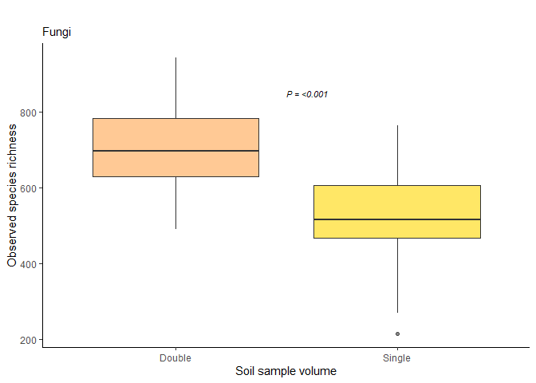<!-- -->

overall recapture rate:

``` r
# we will make two species-by-pot matrices with presence/absence (1/0) data, one 
# for the first samples in every pot and one for the second pot. we'll then merge
# the two matrices, leaving every cell with 0, 1, or 2 identifications per species
# per pot. for every pot, each species will then be
#
#       0 = not identified 
#       1 = identified in one sample
#       2 = identified in both samples
# 
# this will make it easy for us to examine the recapture rate of the different species. 

twice = subset_samples(fungi, interval == "double"); twice # subset pots sampled twice
```

    ## phyloseq-class experiment-level object
    ## otu_table()   OTU Table:         [ 4618 taxa and 40 samples ]
    ## sample_data() Sample Data:       [ 40 samples by 6 sample variables ]
    ## tax_table()   Taxonomy Table:    [ 4618 taxa by 7 taxonomic ranks ]
    ## refseq()      DNAStringSet:      [ 4618 reference sequences ]

``` r
first = subset_samples(twice, grepl(pattern = "_1", # subset first samples
                                    x = twice@sam_data$sample_id)); first = prune_taxa(taxa_sums(first)>0,
                                                                                       first); first
```

    ## phyloseq-class experiment-level object
    ## otu_table()   OTU Table:         [ 2733 taxa and 20 samples ]
    ## sample_data() Sample Data:       [ 20 samples by 6 sample variables ]
    ## tax_table()   Taxonomy Table:    [ 2733 taxa by 7 taxonomic ranks ]
    ## refseq()      DNAStringSet:      [ 2733 reference sequences ]

``` r
first@sam_data$turn = "first"; head(first@sam_data) # assign variable to distinguish from "second" samples
```

    ##                             sample container  host sample_id pot_id interval
    ## PLANTEIMP_21_001_fITS7_ITS4    001         2 Taxus       1_1     p1   double
    ## PLANTEIMP_21_003_fITS7_ITS4    003         2 Taxus       2_1     p2   double
    ## PLANTEIMP_21_005_fITS7_ITS4    005         2 Taxus       3_1     p3   double
    ## PLANTEIMP_21_007_fITS7_ITS4    007         2 Taxus       4_1     p4   double
    ## PLANTEIMP_21_009_fITS7_ITS4    009         2 Taxus       5_1     p5   double
    ## PLANTEIMP_21_021_fITS7_ITS4    021         2 Thuja       1_1    p16   double
    ##                              turn
    ## PLANTEIMP_21_001_fITS7_ITS4 first
    ## PLANTEIMP_21_003_fITS7_ITS4 first
    ## PLANTEIMP_21_005_fITS7_ITS4 first
    ## PLANTEIMP_21_007_fITS7_ITS4 first
    ## PLANTEIMP_21_009_fITS7_ITS4 first
    ## PLANTEIMP_21_021_fITS7_ITS4 first

``` r
first@sam_data$row = paste0(first@sam_data$pot_id, # pot ID
                            "_",                   # _
                            first@sam_data$turn)   # turn

second = subset_samples(twice, grepl(pattern = "_2", # second samples
                                    x = twice@sam_data$sample_id)); second = prune_taxa(taxa_sums(second)>0,
                                                                                        second); second
```

    ## phyloseq-class experiment-level object
    ## otu_table()   OTU Table:         [ 2645 taxa and 20 samples ]
    ## sample_data() Sample Data:       [ 20 samples by 6 sample variables ]
    ## tax_table()   Taxonomy Table:    [ 2645 taxa by 7 taxonomic ranks ]
    ## refseq()      DNAStringSet:      [ 2645 reference sequences ]

``` r
second@sam_data$turn = "second"; head(second@sam_data)
```

    ##                             sample container  host sample_id pot_id interval
    ## PLANTEIMP_21_002_fITS7_ITS4    002         2 Taxus       1_2     p1   double
    ## PLANTEIMP_21_004_fITS7_ITS4    004         2 Taxus       2_2     p2   double
    ## PLANTEIMP_21_006_fITS7_ITS4    006         2 Taxus       3_2     p3   double
    ## PLANTEIMP_21_008_fITS7_ITS4    008         2 Taxus       4_2     p4   double
    ## PLANTEIMP_21_010_fITS7_ITS4    010         2 Taxus       5_2     p5   double
    ## PLANTEIMP_21_022_fITS7_ITS4    022         2 Thuja       1_2    p16   double
    ##                               turn
    ## PLANTEIMP_21_002_fITS7_ITS4 second
    ## PLANTEIMP_21_004_fITS7_ITS4 second
    ## PLANTEIMP_21_006_fITS7_ITS4 second
    ## PLANTEIMP_21_008_fITS7_ITS4 second
    ## PLANTEIMP_21_010_fITS7_ITS4 second
    ## PLANTEIMP_21_022_fITS7_ITS4 second

``` r
second@sam_data$row = paste0(second@sam_data$pot_id, # pot ID
                             "_",                    # _
                             second@sam_data$turn)   # turn

twice = merge_phyloseq(first, 
                       second); twice # merge back together
```

    ## phyloseq-class experiment-level object
    ## otu_table()   OTU Table:         [ 3480 taxa and 40 samples ]
    ## sample_data() Sample Data:       [ 40 samples by 8 sample variables ]
    ## tax_table()   Taxonomy Table:    [ 3480 taxa by 7 taxonomic ranks ]
    ## refseq()      DNAStringSet:      [ 3480 reference sequences ]

``` r
sample_names(twice) = twice@sam_data$row; head(twice@sam_data) # assign the new sample names
```

    ##           sample container  host sample_id pot_id interval  turn       row
    ## p1_first     001         2 Taxus       1_1     p1   double first  p1_first
    ## p2_first     003         2 Taxus       2_1     p2   double first  p2_first
    ## p3_first     005         2 Taxus       3_1     p3   double first  p3_first
    ## p4_first     007         2 Taxus       4_1     p4   double first  p4_first
    ## p5_first     009         2 Taxus       5_1     p5   double first  p5_first
    ## p16_first    021         2 Thuja       1_1    p16   double first p16_first

``` r
colnames(twice@otu_table) = twice@tax_table[,7]

# now we make the new data frame with presence/absence data:
pres.abs.df = data.frame(twice@otu_table) %>% 
  mutate_if(is.numeric, ~1 * (. > 0)) 

pres.abs.df.t = data.frame(t(pres.abs.df)) # transpose to make pots columns

# split first and second samples and clean up the colnames before summarizing:
first = data.frame(pres.abs.df.t) %>% 
  select(matches("_first"))
colnames(first) = sub("_first", "", colnames(first))

second = data.frame(pres.abs.df.t) %>% 
  select(matches("_second"))
colnames(second) = sub("_second", "", colnames(second))

# by summarizing the two data frames, we'll be able to see if species were identified
# 0, 1, or 2 times per pot:
pres.abs.df.fin = data.frame(first+second)

# this is where you find the overall recapture rate of 70.3 % 
table(pres.abs.df.fin==0) # 175 identifications in total (i.e. != 0)
```

    ## 
    ## FALSE  TRUE 
    ## 14498 55102

``` r
table(pres.abs.df.fin==1) # species X was identified in only one sample per pot a total of 123 times
```

    ## 
    ## FALSE  TRUE 
    ## 61198  8402

``` r
table(pres.abs.df.fin==2) # species X was identified in both samples per pot a total of 52 times
```

    ## 
    ## FALSE  TRUE 
    ## 63504  6096

``` r
# check recapture rate for two known alien species to Norway:

crypt = pres.abs.df.fin["Cryptostroma_corticale",] # subset C. corticale
table(crypt==0) # C. corticale was unidentified in 13 pots
```

    ## 
    ## FALSE  TRUE 
    ##     7    13

``` r
table(crypt==1) # C. corticale was identified in one sample in 6 pots
```

    ## 
    ## FALSE  TRUE 
    ##    14     6

``` r
table(crypt==2) # C. corticale was identified twice in one pot
```

    ## 
    ## FALSE  TRUE 
    ##    19     1

``` r
mut = pres.abs.df.fin["Mutinus_ravenelii",] # subset M. ravenellii
table(mut==0) 
```

    ## 
    ## FALSE  TRUE 
    ##    11     9

``` r
table(mut==1) 
```

    ## 
    ## FALSE  TRUE 
    ##    19     1

``` r
table(mut==2)
```

    ## 
    ## FALSE  TRUE 
    ##    10    10

2.  fold increase:

``` r
twice = subset_samples(fungi, interval == "double"); twice = prune_taxa(taxa_sums(twice)>0,
                                                                         twice); twice
```

    ## phyloseq-class experiment-level object
    ## otu_table()   OTU Table:         [ 3480 taxa and 40 samples ]
    ## sample_data() Sample Data:       [ 40 samples by 6 sample variables ]
    ## tax_table()   Taxonomy Table:    [ 3480 taxa by 7 taxonomic ranks ]
    ## refseq()      DNAStringSet:      [ 3480 reference sequences ]

``` r
first = subset_samples(twice, grepl(pattern = "_1", 
                                    x = twice@sam_data$sample_id)); first = prune_taxa(taxa_sums(first)>0,
                                                                                       first); first
```

    ## phyloseq-class experiment-level object
    ## otu_table()   OTU Table:         [ 2733 taxa and 20 samples ]
    ## sample_data() Sample Data:       [ 20 samples by 6 sample variables ]
    ## tax_table()   Taxonomy Table:    [ 2733 taxa by 7 taxonomic ranks ]
    ## refseq()      DNAStringSet:      [ 2733 reference sequences ]

``` r
first@sam_data$turn = "first"; head(first@sam_data) # add a variable to distinguish between first and merged samples
```

    ##                             sample container  host sample_id pot_id interval
    ## PLANTEIMP_21_001_fITS7_ITS4    001         2 Taxus       1_1     p1   double
    ## PLANTEIMP_21_003_fITS7_ITS4    003         2 Taxus       2_1     p2   double
    ## PLANTEIMP_21_005_fITS7_ITS4    005         2 Taxus       3_1     p3   double
    ## PLANTEIMP_21_007_fITS7_ITS4    007         2 Taxus       4_1     p4   double
    ## PLANTEIMP_21_009_fITS7_ITS4    009         2 Taxus       5_1     p5   double
    ## PLANTEIMP_21_021_fITS7_ITS4    021         2 Thuja       1_1    p16   double
    ##                              turn
    ## PLANTEIMP_21_001_fITS7_ITS4 first
    ## PLANTEIMP_21_003_fITS7_ITS4 first
    ## PLANTEIMP_21_005_fITS7_ITS4 first
    ## PLANTEIMP_21_007_fITS7_ITS4 first
    ## PLANTEIMP_21_009_fITS7_ITS4 first
    ## PLANTEIMP_21_021_fITS7_ITS4 first

``` r
second = merge_samples(twice, group = "pot_id"); second 
```

    ## Warning in asMethod(object): NAs introduced by coercion

    ## Warning in asMethod(object): NAs introduced by coercion

    ## Warning in asMethod(object): NAs introduced by coercion

    ## Warning in asMethod(object): NAs introduced by coercion

    ## phyloseq-class experiment-level object
    ## otu_table()   OTU Table:         [ 3480 taxa and 20 samples ]
    ## sample_data() Sample Data:       [ 20 samples by 6 sample variables ]
    ## tax_table()   Taxonomy Table:    [ 3480 taxa by 7 taxonomic ranks ]

``` r
# reassign sample data in second:
second@sam_data$pot_id = rownames(second@sam_data) # fix pot_id variable
second@sam_data$pot_id = sub("p","", second@sam_data$pot_id) 
second@sam_data$pot_id = as.numeric(second@sam_data$pot_id) # this will let us sort by pot_id
second.sam = data.frame(second@sam_data) %>%  # using arrange() in dplyr
  arrange(pot_id) %>%
  mutate(pot_id=paste0("p",pot_id)); head(second.sam); tail(second.sam)
```

    ##     sample container host sample_id pot_id interval
    ## p1     1.5         2   NA        NA     p1       NA
    ## p2     3.5         2   NA        NA     p2       NA
    ## p3     5.5         2   NA        NA     p3       NA
    ## p4     7.5         2   NA        NA     p4       NA
    ## p5     9.5         2   NA        NA     p5       NA
    ## p16   21.5         2   NA        NA    p16       NA

    ##     sample container host sample_id pot_id interval
    ## p35   49.5         1   NA        NA    p35       NA
    ## p46   61.5         1   NA        NA    p46       NA
    ## p47   63.5         1   NA        NA    p47       NA
    ## p48   65.5         1   NA        NA    p48       NA
    ## p49   67.5         1   NA        NA    p49       NA
    ## p50   69.5         1   NA        NA    p50       NA

``` r
# now make an identical dataframe to get variables from: 
sam = data.frame(twice@sam_data) 
sam = sam %>%
  filter(grepl(pattern = "_2", 
               sam$sample_id))

# and reassign variables: 
second.sam$host = sam$host
second.sam$container = sam$container
second.sam$interval = sam$interval
second.sam$turn = "second"; # add a variable to distinguish between merged and first samples

# convert til sample_data() object:
second.sam = sample_data(second.sam); sample_names(second.sam)
```

    ##  [1] "p1"  "p2"  "p3"  "p4"  "p5"  "p16" "p17" "p18" "p19" "p20" "p31" "p32"
    ## [13] "p33" "p34" "p35" "p46" "p47" "p48" "p49" "p50"

``` r
# and reassign to twice.m phyloseq object: 
sample_data(second) = second.sam; twice.m; head(second@sam_data)
```

    ## phyloseq-class experiment-level object
    ## otu_table()   OTU Table:         [ 4618 taxa and 20 samples ]
    ## sample_data() Sample Data:       [ 20 samples by 6 sample variables ]
    ## tax_table()   Taxonomy Table:    [ 4618 taxa by 7 taxonomic ranks ]

    ##     sample container  host sample_id pot_id interval   turn
    ## p1     1.5         2 Taxus        NA     p1   double second
    ## p16   21.5         2 Thuja        NA    p16   double second
    ## p17   23.5         2 Thuja        NA    p17   double second
    ## p18   25.5         2 Thuja        NA    p18   double second
    ## p19   27.5         2 Thuja        NA    p19   double second
    ## p2     3.5         2 Taxus        NA     p2   double second

``` r
# now we can merge the two phyloseq objects in order to normalize them:
fiphy = merge_phyloseq(first, second); fiphy
```

    ## phyloseq-class experiment-level object
    ## otu_table()   OTU Table:         [ 2733 taxa and 40 samples ]
    ## sample_data() Sample Data:       [ 40 samples by 7 sample variables ]
    ## tax_table()   Taxonomy Table:    [ 2733 taxa by 7 taxonomic ranks ]
    ## refseq()      DNAStringSet:      [ 2733 reference sequences ]

``` r
# normalize the new phyloseq object:
sort(sample_sums(fiphy)) # we can normalize at the lowest read depth to keep all samples and only lose two taxa:
```

    ## PLANTEIMP_21_005_fITS7_ITS4 PLANTEIMP_21_063_fITS7_ITS4 
    ##                      213969                      302589 
    ## PLANTEIMP_21_065_fITS7_ITS4 PLANTEIMP_21_069_fITS7_ITS4 
    ##                      313503                      332749 
    ## PLANTEIMP_21_009_fITS7_ITS4                         p47 
    ##                      384987                      392724 
    ## PLANTEIMP_21_023_fITS7_ITS4 PLANTEIMP_21_061_fITS7_ITS4 
    ##                      392795                      449544 
    ## PLANTEIMP_21_041_fITS7_ITS4 PLANTEIMP_21_029_fITS7_ITS4 
    ##                      469625                      471580 
    ## PLANTEIMP_21_027_fITS7_ITS4 PLANTEIMP_21_047_fITS7_ITS4 
    ##                      482671                      488302 
    ## PLANTEIMP_21_043_fITS7_ITS4                          p3 
    ##                      493170                      510769 
    ## PLANTEIMP_21_049_fITS7_ITS4                          p5 
    ##                      569472                      594384 
    ## PLANTEIMP_21_045_fITS7_ITS4                         p46 
    ##                      608301                      608805 
    ## PLANTEIMP_21_025_fITS7_ITS4 PLANTEIMP_21_003_fITS7_ITS4 
    ##                      609430                      626299 
    ## PLANTEIMP_21_021_fITS7_ITS4 PLANTEIMP_21_001_fITS7_ITS4 
    ##                      632952                      677194 
    ## PLANTEIMP_21_067_fITS7_ITS4                         p48 
    ##                      693109                      701275 
    ##                         p32 PLANTEIMP_21_007_fITS7_ITS4 
    ##                      741761                      775701 
    ##                         p50                         p33 
    ##                      866309                      868924 
    ##                         p17                         p19 
    ##                      922774                      934161 
    ##                         p31                          p2 
    ##                      978329                     1065561 
    ##                         p35                         p18 
    ##                     1256453                     1317255 
    ##                          p4                         p16 
    ##                     1321058                     1336785 
    ##                         p34                          p1 
    ##                     1342176                     1396802 
    ##                         p49                         p20 
    ##                     1462784                     1611639

``` r
fiphyrar = rarefy_even_depth(fiphy, 
                             rngseed = 123, 
                             replace = FALSE, 
                             trimOTUs = TRUE, 
                             sample.size = 213969); fiphy; fiphyrar
```

    ## `set.seed(123)` was used to initialize repeatable random subsampling.

    ## Please record this for your records so others can reproduce.

    ## Try `set.seed(123); .Random.seed` for the full vector

    ## ...

    ## 13OTUs were removed because they are no longer 
    ## present in any sample after random subsampling

    ## ...

    ## phyloseq-class experiment-level object
    ## otu_table()   OTU Table:         [ 2733 taxa and 40 samples ]
    ## sample_data() Sample Data:       [ 40 samples by 7 sample variables ]
    ## tax_table()   Taxonomy Table:    [ 2733 taxa by 7 taxonomic ranks ]
    ## refseq()      DNAStringSet:      [ 2733 reference sequences ]

    ## phyloseq-class experiment-level object
    ## otu_table()   OTU Table:         [ 2720 taxa and 40 samples ]
    ## sample_data() Sample Data:       [ 40 samples by 7 sample variables ]
    ## tax_table()   Taxonomy Table:    [ 2720 taxa by 7 taxonomic ranks ]
    ## refseq()      DNAStringSet:      [ 2720 reference sequences ]

``` r
# now we have to separate the new object into two dataframes before we combine
# them to calculate and plot fold increase: 
first = subset_samples(fiphyrar, turn=="first")
first.df = data.frame(cbind(estimate_richness(first, 
                                              measures = "Observed"),
                            first@sam_data)) %>% 
  rename("obs_first"="Observed",
         "pot_id_first"="pot_id",
         "turn_first"="turn") %>% 
  mutate(pot_id=pot_id_first); head(first.df)
```

    ##                             obs_first sample container  host sample_id
    ## PLANTEIMP_21_001_fITS7_ITS4       450    001         2 Taxus       1_1
    ## PLANTEIMP_21_003_fITS7_ITS4       658    003         2 Taxus       2_1
    ## PLANTEIMP_21_005_fITS7_ITS4       600    005         2 Taxus       3_1
    ## PLANTEIMP_21_007_fITS7_ITS4       780    007         2 Taxus       4_1
    ## PLANTEIMP_21_009_fITS7_ITS4       663    009         2 Taxus       5_1
    ## PLANTEIMP_21_021_fITS7_ITS4       412    021         2 Thuja       1_1
    ##                             pot_id_first interval turn_first pot_id
    ## PLANTEIMP_21_001_fITS7_ITS4           p1   double      first     p1
    ## PLANTEIMP_21_003_fITS7_ITS4           p2   double      first     p2
    ## PLANTEIMP_21_005_fITS7_ITS4           p3   double      first     p3
    ## PLANTEIMP_21_007_fITS7_ITS4           p4   double      first     p4
    ## PLANTEIMP_21_009_fITS7_ITS4           p5   double      first     p5
    ## PLANTEIMP_21_021_fITS7_ITS4          p16   double      first    p16

``` r
second = subset_samples(fiphyrar, turn=="second")
second.df = data.frame(cbind(estimate_richness(second, 
                                              measures = "Observed"),
                            second@sam_data)) %>% 
  rename("obs_second"="Observed",
         "pot_id_second"="pot_id",
         "turn_second"="turn") %>% 
  mutate(pot_id=pot_id_second); head(second.df)
```

    ##     obs_second sample container  host sample_id pot_id_second interval
    ## p1         720    1.5         2 Taxus      <NA>            p1   double
    ## p16        500   21.5         2 Thuja      <NA>           p16   double
    ## p17        649   23.5         2 Thuja      <NA>           p17   double
    ## p18        706   25.5         2 Thuja      <NA>           p18   double
    ## p19        648   27.5         2 Thuja      <NA>           p19   double
    ## p2         839    3.5         2 Taxus      <NA>            p2   double
    ##     turn_second pot_id
    ## p1       second     p1
    ## p16      second    p16
    ## p17      second    p17
    ## p18      second    p18
    ## p19      second    p19
    ## p2       second     p2

``` r
fidf = full_join(first.df, second.df, by = "pot_id") %>% 
  select("obs_first", "obs_second", 
         "pot_id", "pot_id_first", "pot_id_second", 
         "turn_first", "turn_second")

fidf = fidf %>% 
  mutate(foldincrease = obs_second/obs_first)

fig3.b.f=ggplot(fidf, aes(x=reorder(pot_id, -foldincrease), 
                 y=foldincrease,
                 fill="tan1", color="black")) + 
  geom_col(width=1) +
  scale_fill_manual(values = "tan1") +
  scale_color_manual(values = "black") +
  theme_classic() +
  theme(legend.position = "none", 
        axis.ticks.x = element_blank()
      ) + 
  ylab("Fold increase") + 
  xlab("Sampled pots") +
  scale_x_discrete(labels = paste0(rep(" ", times=20))) +
  labs(title = " ",
       subtitle = "Fungi") +
  annotate(geom = "text", 
           x=5, 
           y=1.75, 
           label = paste0("Median = ", 
                         round(median(fidf$foldincrease), 
                               digits = 2)), # calculate and annotate manually...
           fontface = "italic", 
           size=3, 
           color="black", 
           hjust=0) +
  scale_y_continuous(breaks = seq(0, 3, 0.5), limits = c(0, 3)) + 
  coord_cartesian(ylim = c(0.9, 3)); fig3.b.f
```

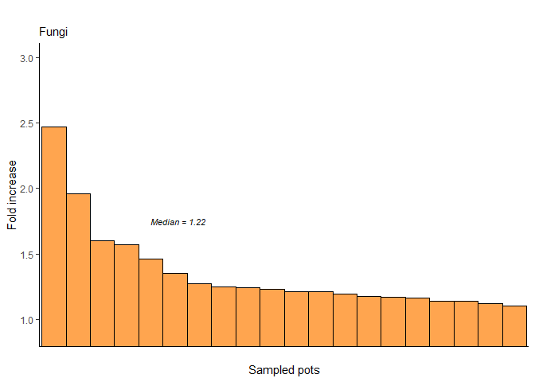<!-- -->

``` r
# additionally, we will investigate whether there is a correlation between 
# the richness in the second sample and fold increase for each pot:
cormod = cor.test(fidf$foldincrease, fidf$obs_second, 
         method = "pearson")
fig3.c.f=ggplot(fidf, aes(x=obs_second, 
                 y=foldincrease,
                 fill="tan1")) + 
  theme_classic() +
  theme(legend.position = "none", 
        ) +
  scale_color_manual(values = "black") + 
  scale_fill_manual(values = "tan1") +
  geom_point(size=6, pch=21) + 
  geom_smooth(method = "lm", 
              color="black", 
              fill="grey90") +
  #scale_x_continuous(breaks = seq(0, 20, 5)) +
  scale_y_continuous(breaks = seq(0, 4, 0.5), 
                    limits = c(0, 3.6)) +
  xlab("Richness in both samples") +
  ylab("\nFold increase") + 
  labs(title = " ",
       subtitle = "Fungi") +
  coord_cartesian(ylim = c(1,3)) + 
  annotate(geom = "text", 
           x=750, 
           y=2.5, 
           label = paste0("r = ", 
                          round(cormod$estimate, 
                                digits = 3),
                          "\nP = ",
                          round(cormod$p.value,
                                digits = 3)), 
           fontface = "italic", size=3, color="black", 
           hjust = 0); fig3.c.f
```

    ## `geom_smooth()` using formula = 'y ~ x'

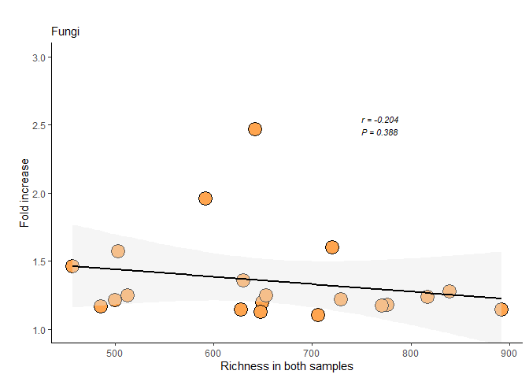<!-- -->

combine into Fig. 3:

``` r
fig3 = ggarrange(fig3.a.p,NULL,fig3.b.p,NULL,fig3.c.p,
                 fig3.a.f,NULL,fig3.b.f,NULL,fig3.c.f,
                 nrow=2,ncol=5, 
                 widths = c(3.5, 0.4, 3.5, 0.4, 3.5,
                            3.5, 0.4, 3.5, 0.4, 3.5)); fig3 # pdf landscape 6 x 10
```

    ## `geom_smooth()` using formula = 'y ~ x'
    ## `geom_smooth()` using formula = 'y ~ x'

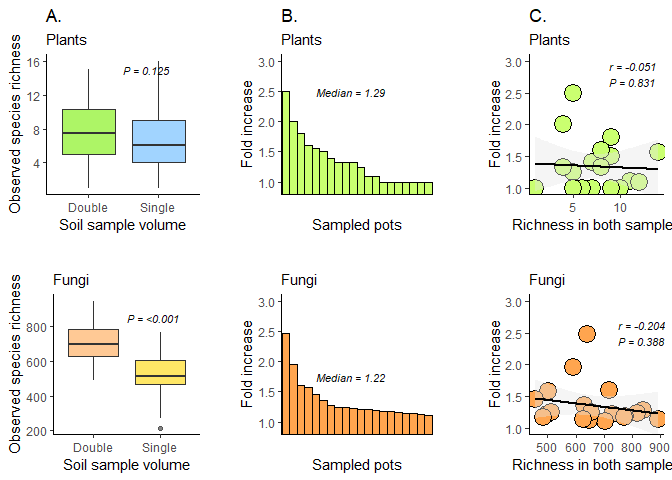<!-- -->
